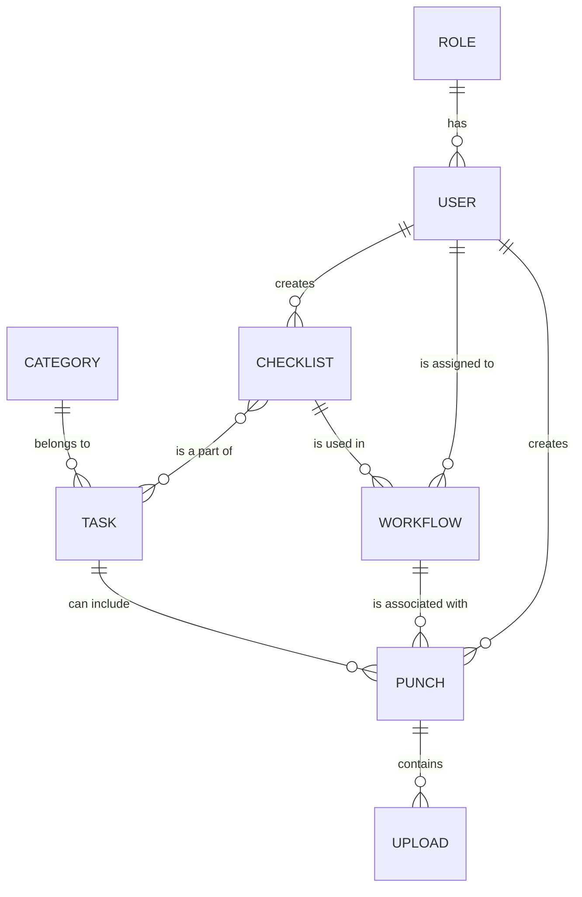

# turbin-sikker-api

## Run API

Clone and Run the API Application:

1. Clone repo: `gh repo clone OptiCorp/turbin-sikker-api`
2. Navigate to project folder: `cd turbin-sikker-api/`
3. Run API: `cd turbin.sikker.core && dotnet run`

## ER Diagram



## Initial Schema

[initial_schema.sql](initial_schema.sql)

## Database Migration

After changing models, services, contollers or context, run the following command:

```dotnet
dotnet ef migrations add <NameOfChanges>
dotnet ef database update (or start the solution)
```

To undo migration, run the following command:

```dotnet
dotnet ef migrations remove
dotnet ef database update (or start the solution)
```

or:

```dotnet
dotnet ef database update <NameofMigrationYouWantToRevertTo>
dotnet ef migrations remove (will remove all migration after the one you reverted to)
```
